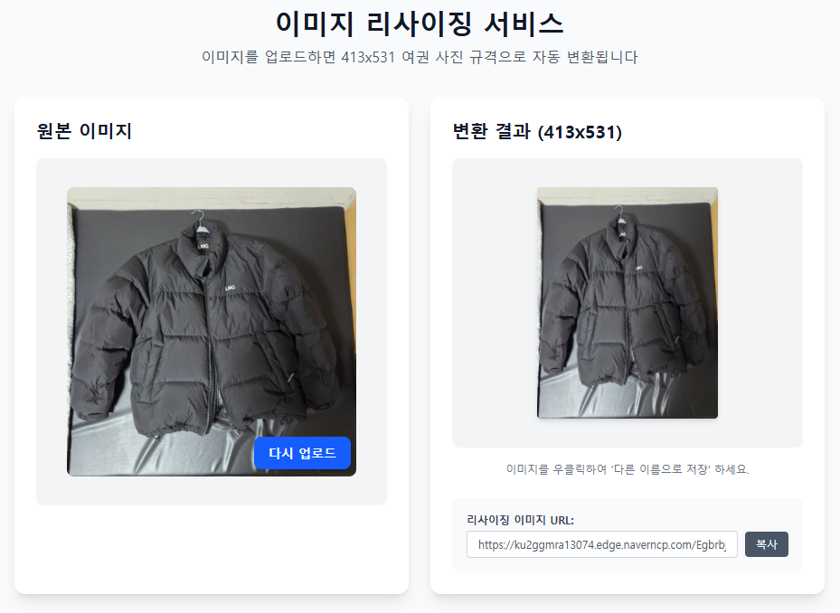

# 이미지 리사이징 서비스 (여권 사진 413x531)

React + Vite + TypeScript + Tailwind 기반의 간단한 이미지 리사이징 프론트엔드입니다. 이미지를 업로드하면 백엔드가 413x531(여권 사진 규격)로 변환한 URL을 반환하며, 프론트는 그 URL을 그대로 표시합니다.



## ✅ 핵심 기능

- 여권 사진 규격 413x531로 자동 변환
- 최대 40MB 업로드 지원(JPG/PNG/WebP)
- 업로드 즉시 미리보기, 변환 URL 표시/복사
- 업로드 중 파일 입력 비활성화, 명확한 에러 알림

## ✨ 기술 스택

- **Framework**: [React](https://react.dev/)
- **Build Tool**: [Vite](https://vitejs.dev/)
- **Language**: [TypeScript](https://www.typescriptlang.org/)
- **Styling**: [Tailwind CSS](https://tailwindcss.com/)
- **Linting**: [ESLint](https://eslint.org/)
- **Formatting**: [Prettier](https://prettier.io/)

## 📦 폴더 구조 (요약)

- `src/App.tsx`: 메인 UI. 업로드/미리보기/결과 URL 표시
- `src/api/http.ts`: Axios 인스턴스 설정 (`baseURL`, 타임아웃 등)
- `src/api/upload.ts`: 업로드 API 호출 (`POST /upload`)
- `public/favicon.svg`: 커스텀 파비콘
- `index.html`: 문서 메타, 파비콘 연결, 루트 마운트

## 🔌 백엔드 연동

- 기본 경로: `'/api'` (`src/api/http.ts`)
- 라우팅
  - 개발: Vite dev server 프록시(`/api → http://localhost:3000`)
  - 운영: 웹 서버(Nginx)에서 `/api` 리버스 프록시
- 엔드포인트
  - `POST /upload` (multipart/form-data, 필드 `image`)
  - 응답에 `optimizedUrl` 포함됨 — 상세 명세는 아래 "API 명세" 참조

### API 명세(스펙) 요약

- 요청: `multipart/form-data`로 `image` 필드 필수
- 응답 필드: `optimizedUrl`, `fileKey`, `originalUrl`, `appliedOptions`, `message`
- 사용 규칙: 프론트는 `optimizedUrl`을 그대로 표시/복사만 수행 (URL 수정 없음)
- 예시: `...?type=u&w=413&h=531&quality=100`

### 프록시 구성

- 개발: 이미 `vite.config.ts`에 `/api` 프록시가 설정되어 있어 CORS 없이 동작합니다.
- 운영: 웹 서버(Nginx)에서 동일 경로(`/api`)로 백엔드 WAS에 프록시하도록 설정하세요.

## ⚙️ 프론트 동작 요약

- 최대 용량: 40MB (`App.tsx`의 `MAX_SIZE`)
- 지원 형식: JPG, PNG, WebP (브라우저 HEIC 미지원)
- 업로드 즉시:
  - 로컬 미리보기 표시 (FileReader)
  - API 호출 → 백엔드가 준 `optimizedUrl` 그대로 사용
- UI:
  - 결과 URL 입력창은 항상 표시 (업로드 전엔 플레이스홀더/복사 비활성화)
  - 이미지 우클릭으로 저장 안내 문구 제공
  - 업로드 중 `file` 입력 비활성화 처리

## 🚀 시작하기

### 요구 사항

- [Node.js](https://nodejs.org/)와 [Yarn](https://yarnpkg.com/) 설치

### 설치

```bash
yarn install
```

### 개발 서버 실행

```bash
yarn dev
```

브라우저에서 개발 서버 주소(일반적으로 `http://localhost:5173`)로 접속하세요.

### 프로덕션 빌드

```bash
yarn build
yarn preview
```

## 🖼 파비콘

- 커스텀 아이콘: `public/favicon.svg`
- `index.html`에서 `/favicon.svg`로 연결됨

## ✍️ 참고

- 문구와 메타: `index.html`은 한국어(`lang="ko"`), 타이틀/설명도 서비스 목적에 맞게 설정됨
- 사이즈 규격: 여권 사진 413x531으로 변환 (서버에서 생성한 URL을 그대로 사용)

## 🧪 스크립트

- `yarn dev`: 개발 서버 실행
- `yarn build`: 프로덕션 빌드 생성
- `yarn preview`: 빌드 결과 로컬 미리보기
- `yarn lint`: ESLint 실행
- `yarn format`: Prettier 포맷팅

## 🚀 배포

### 네이버 클라우드 Web 서버 배포

이 프로젝트는 네이버 클라우드 플랫폼의 Web 서버에 배포되어 있습니다.

#### 배포 방법

1. **SSL VPN 연결**
   - 네이버 클라우드 콘솔에서 SSL VPN 클라이언트 다운로드 및 설치
   - VPN 연결 후 내부 네트워크 접근 가능

2. **프로덕션 빌드**

   ```bash
   yarn build
   ```

3. **서버로 파일 전송 (SCP)**

   ```bash
   scp -r .\dist\* root@10.0.10.6:/var/www/html/
   ```

4. **배포 확인**
   - 브라우저에서 서버 주소로 접속하여 확인
   - Nginx/Apache 설정에 따라 정적 파일 서빙 확인

5. **Nginx 파일 업로드 용량 설정 (필수)**

   ```bash
   # /etc/nginx/nginx.conf 편집
   sudo vi /etc/nginx/nginx.conf

   # http 블록 안에 추가
   client_max_body_size 50M;

   # Nginx 재시작
   sudo systemctl restart nginx
   ```

#### 서버 정보

- **내부 IP**: `10.0.10.6`
- **웹 루트**: `/var/www/html/`
- **접근 방식**: SSL VPN을 통한 내부 네트워크 접속
- **Nginx 설정**: 파일 업로드 최대 용량 50MB

#### 주의사항

- 프론트는 항상 `/api`로 호출합니다. 운영 환경에서 웹 서버 리버스 프록시를 통해 백엔드로 전달되도록 설정하세요.
- 프론트(40MB) + 백엔드(50MB) 용량 제한이 일치하도록 Nginx 설정 필수

## 🧩 문제 해결 (Troubleshooting)

- 413 Request Entity Too Large: 파일이 40MB를 초과했거나 Nginx `client_max_body_size` 미설정
- 400 Bad Request: 잘못된 FormData(필드명 불일치: `image`) 또는 손상된 파일
- 500 Internal Server Error: WAS 내부 오류. 서버 로그 확인 후 재시도
- 업로드 지연/타임아웃: 네트워크 품질 저하 또는 파일이 매우 큼 → 다시 시도하거나 파일 크기 축소

## 🔐 운영 팁

- CORS: 같은 도메인/프록시를 사용하면 단순화 가능
- 캐시: 최종 변환 이미지는 CDN(Image Optimizer)에서 캐시되므로 프론트 캐시 제어는 최소화
- 접근: 내부망 배포 시 SSL VPN 연결 필수 (문서의 배포 단계 참고)
